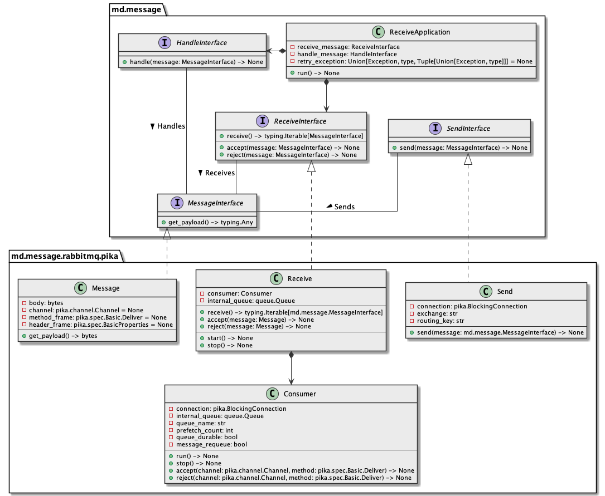
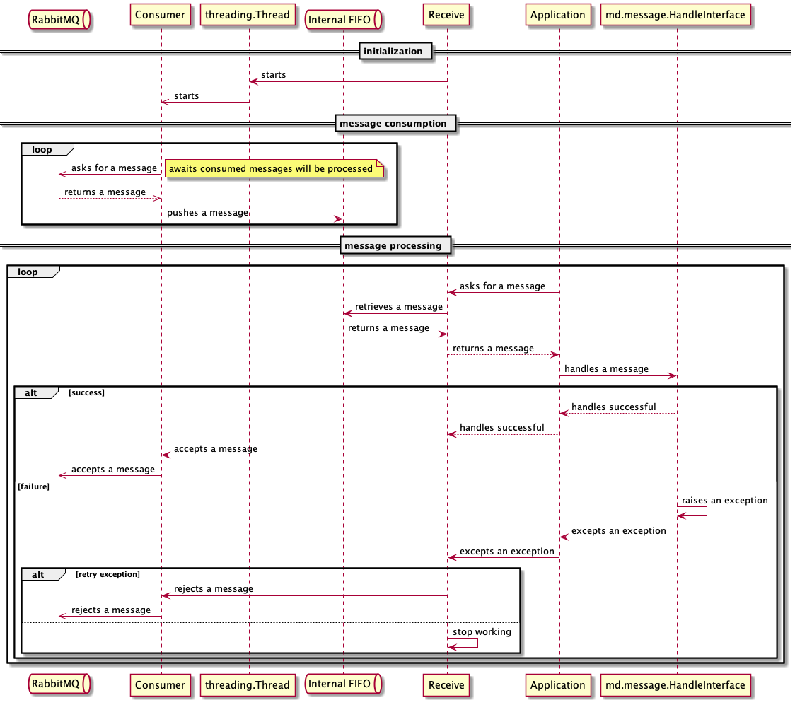

# md.message.rabbitmq.pika

md.message.rabbitmq.pika component provides [RabbitMQ](#) message queue 
implementation of [md.message](#) contracts as adapter on top of [pika](#) client
and provides few useful tools out from box.

## Architecture overview



## Installation

```sh
pip install md.message.rabbitmq.pika --index-url https://source.md.land/python/
```

## Usage example
### Replicate queue message

Example below reuses connection to rabbitmq to read `queue-to-read` queue 
in two threads and copy data from it to `queue-to-write` queue.

```python3
#!/usr/bin/env python3
import queue
import ssl
import threading
import json
import signal

import pika
import pika.channel

import md.message
import md.message.rabbitmq.pika


class MessageHandler(md.message.HandleInterface):
    def __init__(self, send_queue: md.message.SendInterface) -> None:
        self._send_queue = send_queue

    def handle(self, message: md.message.MessageInterface) -> None:
        payload = message.get_payload()
        assert isinstance(payload, bytes)

        data = json.loads(payload.decode('utf-8'))
        print(data)
        
        self._send_queue.send(message=message)


def main() -> int:
    rmq_user = 'user'
    rmq_password = 'password'
    rmq_host = 'server.tld'
    rmq_vhost = 'server.tld'
    rmq_port = 5671
    workers_count = 2
    rmq_read_queue = 'queue-to-read'
    rmq_exchange = 'queue-to-write'
    rmq_routing_key = 'queue-to-write'
    
    # arrange pika
    context = ssl.SSLContext(ssl.PROTOCOL_TLSv1_2)
    ssl_options = pika.SSLOptions(context)
    credentials = pika.PlainCredentials(username=rmq_user, password=rmq_password)
    connection_parameters = pika.ConnectionParameters(
        host=rmq_host,
        credentials=credentials,
        ssl_options=ssl_options,
        virtual_host=rmq_vhost,
        port=rmq_port,
    )
    connection = pika.BlockingConnection(connection_parameters)    

    # arrange internals
    internal_queue = queue.Queue()
    consumer = md.message.rabbitmq.pika.Consumer(
        connection=connection,
        internal_queue=internal_queue,
        rmq_read_queue=rmq_read_queue,
        prefetch_count=workers_count,
    )
    message_queue_receive = md.message.rabbitmq.pika.Receive(consumer=consumer, internal_queue=internal_queue)
    message_queue_send = md.message.rabbitmq.pika.Send(connection=connection, exchange=rmq_exchange, routing_key=rmq_routing_key)

    message_handler = MessageHandler(send_queue=message_queue_send)
    application = md.message.ReceiveApplication(
        message_queue=message_queue_receive,
        message_handler=message_handler,
    )

    # act
    signal.signal(signal.SIGINT, lambda: message_queue_receive.stop)  # 2
    signal.signal(signal.SIGTERM, lambda: message_queue_receive.stop)  # 15
    thread_set = set()
    try:
        message_queue_receive.start()
        for _ in range(workers_count):
            thread = threading.Thread(target=application.run, daemon=True)
            thread_set.add(thread)
            thread.start()
        for thread in thread_set:
            thread.join()
        message_queue_receive.stop()
    finally:
        if connection.is_open:
            connection.close()
    return 0


if __name__ == '__main__':
    main()
```

## Internals interaction overview



