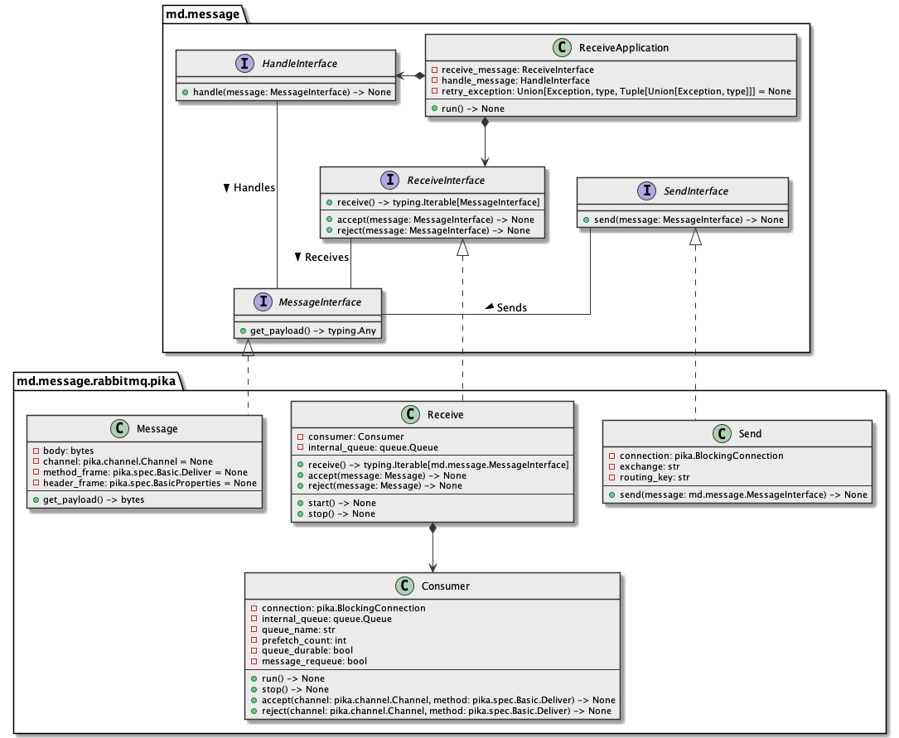

# md.message.rabbitmq.pika

md.message.rabbitmq.pika component provides [RabbitMQ](#) message queue 
implementation of [md.message](#) contracts as adapter of [pika](#) 
and provides few useful tools out from box.

## Architecture overview



## Installation

```sh
pip install md.message.rabbitmq.pika --index-url https://source.md.land/python/
```

## [Documentation](./docs/index.md)

Read documentation with examples: https://development.md.land/python/md.message.rabbitmq.pika/

## [Changelog](changelog.md)
## [License (MIT)](license.md)
